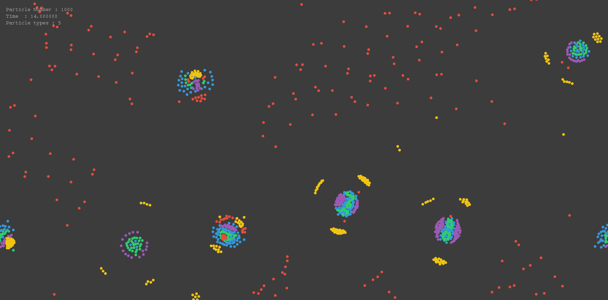
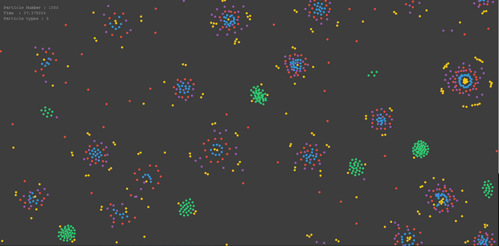
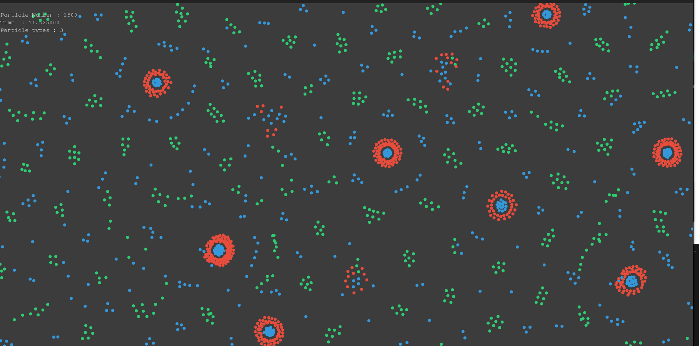

#  Particle Life Simulation (C++ / SFML)

A C++ simulation of particle interactions inspired by the *"Particle Life"* concept, using **SFML** for real-time visualization. Multiple particle types interact with one another through a customizable force matrix, exhibiting emergent behavior such as clustering, oscillation, and movement patterns.

---

## 🧪 Features

- ✅ Multi-type particle system (with user-defined attractive/repulsive forces)
- ✅ Real-time simulation and visualization using **SFML**
- ✅ Adjustable parameters (particle count, interaction strength, temperature, etc.)
- ✅ Support for **reflecting** and **periodic boundary conditions**
- ✅ Overlay of runtime stats (time elapsed, particle count, etc.)

---

## 🗂️ Project Structure

```
Particle-Life-2D/
│
├── src/
│ ├── main.cpp # Entry point, initializes the Manager
│ ├── manager.h / .cpp # Manages window, simulation loop, rendering
│ ├── simulation.h / .cpp # Core physics: particle updates, interactions
│ ├── particle.h / .cpp # Particle class: state, rendering
│ ├── text.h / .cpp # Text overlay utility using SFML
│ ├── parameters.h # Global simulation parameters
│
├── assets/
│ └── font.ttf # Font used for text overlays
│
├── include/ # (Optional) For public headers, if modularizing
│
├── CMakeLists.txt # CMake build configuration (optional)
├── README.md # This file
```
---

## 🔧 Build Instructions

### 🧱 Build (with CMake)
```
mkdir build && cd build
cmake ..
make
./app
```

## Simulation Parameters
Modify values in parameters.h:

## Behavior Explanation
* Each particle has a type.

* Particles apply forces to each other based on the ```forcefield[typeA][typeB]``` value.

* Forces are limited to a certain interaction radius.

* Movement uses a Verlet-like update.





## Possible improvement
* The forces are calculated for each pair of particles in simulation box making it very difficult to scale in the number of particles. A neighbour list or grid method to limit the distant interactions can imporve the performance
* Also could be extended to 3D 
* Add GUI for controls.

